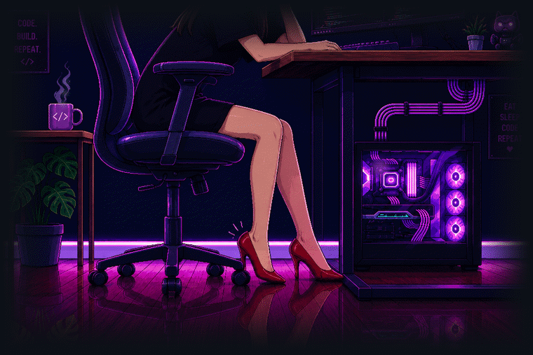

<h1 align="center">Hie, I'm Mudrikaa 👋</h1>

<!-- animated rotating title -->
<p align="center">
  
</p>

<!-- hero cinemagraph -->
<p align="center">
  
</p>

---

<h3 align="center">🌙 WHO AM I</h3>

```ts
const mudrikaaa = {
  role: "full-stack dev + AI/ML tinkerer",
  currently: "teaching machines to think so I can overthink less",
  design: "I add more color to my UIs than to my outfits",
  fuel: "playlists + questionable amounts of focus",
};
```

<p align="center">
  🐛 I speak fluent bug and semi-fluent feature<br/>
  🤖 Deep in AI/ML, teaching models to (mostly) behave<br/>
  🎓 CS undergrad at Thapar (TIET), powered by deadlines and DSA
</p>

---

<h3 align="center">⟨ Tech & Tools ⟩</h3>

<p align="center">
  
</p>

---

<h3 align="center">🌱 Find me being productive (or not)</h3>

<p align="center">
  <a href="mailto:mudrikakumawat24@gmail.com"></a>
  &nbsp;&nbsp;
  <a href="https://www.linkedin.com/in/mudrika-kumawat/"></a>
  &nbsp;&nbsp;
  <a href="https://instagram.com/mudriikaa__"></a>
</p>
